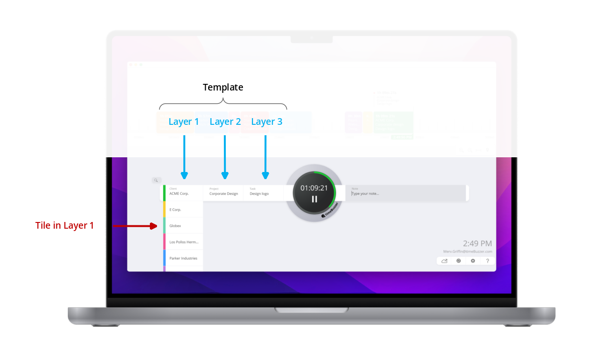

# timeBuzzer Open API Documentation

Welcome to the timeBuzzer API Documentation. The timeBuzzer API is a REST API. You can can create items like projects, customers or tasks, you can create and edit time entries and receive new time entries via webhooks.

Here you find the list of **all API requests**: https://my.timebuzzer.com/doc

Here you find a the most common requests prepard in **Postman**: https://www.postman.com/timebuzzer/workspace/open-api/documentation/2798570-5c8228e6-ec5b-4cd2-8341-0f0ad69b229f

The timeBuzzer **website**: https://timebuzzer.com

## Data Model

To understand the data structure of timeBuzzer, we take a look at the Desktop App. You navigate from top to bottom to choose your projects, customers, cost center, tasks etc. you want to track your time on.

### Tiles
Tiles are objects like “Project A”, “Customer B”, “Cost center C” or similar.

### Layers
Tiles are organized in Layers. For instance, all customer tiles are related to the same Layer called “Customer”. You can create 1, 2 or 3 Layers and give the Layers a name. This allows you to fit timeBuzzer for the individual needs of a company.

Examples:

1) Some companies track their time on projects only. In this case you need just 1 Layer and name it “Projects”.
2) Other companies track their time on projects and cost centers. You define 2 Layers, name the first “Projects” and the second “Cost Centers”.
3) Some companies track their time on Projects, Sub-Projects and Tasks. (You define 3 Layers and name them…)

Technically, the order of the Layers is defined by child/parent-relations between Layers.

### Templates
The Layers are organized in a Template. Each user is related to one Template. So, the Template defines the Layers that are shown to the user.

In most cases, a company needs only one Template for all users of the company. Example: a company wants to track the working time on projects and tasks, you define a Template with 2 Layers and name the first Layer “Projects” and the second Layer “Tasks”. Every user is related to this Template.

### Dependencies between Tiles
In practice there are different needs, how relations between Tiles like projects, tasks or customers should be. For this, Tiles can be a child of Tile(s) in the upper Layer, and also be a parent to Tile(s) in the lower Layer.

A Tile can also be “global”, what means the Tile will be handled like it would be a child to every Tile in the upper Layer (also to Tiles you will add to the upper Layer in the future). A global is defined by

“type”: 2,

Child/Parent–relationships allows you, to combine this Use cases. For instance, you can create Cost-Centers-Tiles that are global and so available to all Project-Tiles, but you can add some Cost-Center-Tiles that are only related to some specific Project-Tiles.

 	 	

Use case | Layer configuration| Parent/Child- Dependencies 
--- | --- | --- 
The company tracks time on customers and projects. Customers have one or more projects. Each project is related to one customer. | Layer 1: “Customers”, Layer 2: “Projects”| Customer-Tile: Parent to n Projects-Tiles, Project-Tile: Child of 1 Customer-Tiles
The company tracks time on projects and departments. Some departments of the company work on the same projects.| Layer 1: “Projects”, Layer 2: “Department”| Project-Tile: Parent to n Department-Tiles, Department Tiles: Child of n Project-Tiles
The company tracks time on projects and cost centers. The company uses the same cost center on all projects.| Layer 1: “Projects”, Layer 2: “Cost Centers” | Project-Tiles: no child-Tiles, Cost Center-Tile: is defined as global and so will be shown under all “Project”-Tiles 

